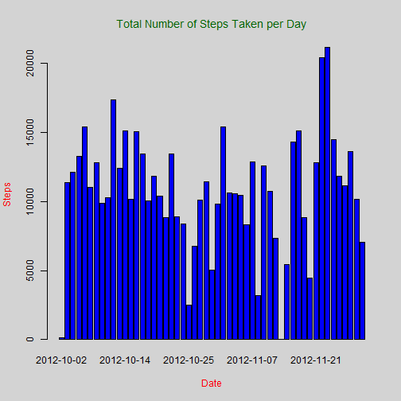
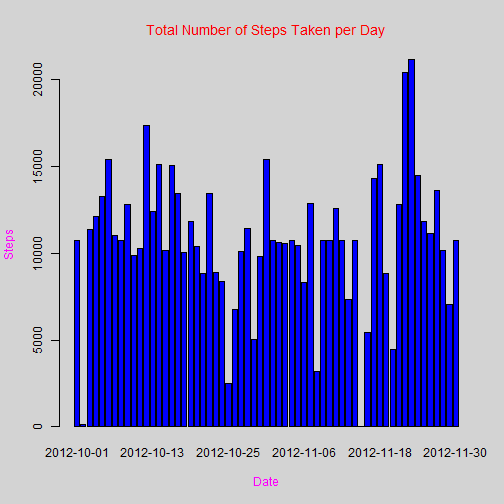
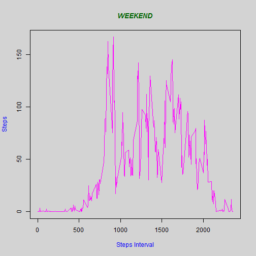

Reproducible Research - Project 1
=================================
   
The github repository with RMarkdown source code as follows:
https://github.com/stevyi/Reproducible_Research_Project1  

## Loading and preprocessing the data

```r
unzip("activity.zip")
Activity <- read.csv("activity.csv")
```

## What is the mean total number of steps taken per day?

1. Make a histogram of the total number of steps taken each day


```r
StepsDay <- aggregate(steps ~ date, data=Activity, FUN=sum)
par(col.lab="red",col.main="dark green",bg="light grey",font.main=4)
barplot(StepsDay$steps,names.arg=StepsDay$date,col=28,xlab="Date",ylab="Steps",main=expression("Total Number of Steps Taken per Day"))
```

 

2. Calculate and report the **mean** and **median** total number of steps taken per day


```r
mean(StepsDay$steps)
```

```
## [1] 10766.19
```

```r
median(StepsDay$steps)
```

```
## [1] 10765
```

## What is the average daily activity pattern?

1. Make a time series plot (i.e. `type = "l"`) of the 5-minute interval (x-axis) and the average number of steps taken, averaged across all days (y-axis)


```r
StepsInterval <- aggregate(steps ~ interval, data=Activity, FUN=mean)
par(mfrow=c(1,1),col.lab="blue",col.main="dark green",font.main=4,bg="light grey")
plot(StepsInterval, type="l",col=118,xlab="Steps Interval",ylab="Steps",main="Average Daily Activity Pattern")
```

 

2. Which 5-minute interval, on average across all the days in the dataset, contains the maximum number of steps?


```r
StepsInterval$interval[which.max(StepsInterval$steps)]
```

```
## [1] 835
```


## Imputing missing values

1. Calculate and report the total number of missing values in the dataset (i.e. the total number of rows with `NA`s)


```r
sum(is.na(Activity))
```

```
## [1] 2304
```

2. Devise a strategy for filling in all of the missing values in the dataset. The strategy does not need to be sophisticated. For example, you could use the mean/median for that day, or the mean for that 5-minute interval, etc.

Means for the 5-minute intervals is used as fillers for missing values.

3. Create a new dataset that is equal to the original dataset but with the missing data filled in.


```r
Activity <- merge(Activity, StepsInterval, by="interval", suffixes=c("",".y"))
FillNA <- is.na(Activity$steps)
Activity$steps[FillNA] <- Activity$steps.y[FillNA]
Activity <- Activity[,c(1:3)]
```

4. Make a histogram of the total number of steps taken each day and Calculate and report the **mean** and **median** total number of steps taken per day. Do these values differ from the estimates from the first part of the assignment? What is the impact of imputing missing data on the estimates of the total daily number of steps?


```r
StepsDay <- aggregate(steps ~ date, data=Activity, FUN=sum)
par(col.lab=118,col.main=18,bg="light grey",font.main=4)
barplot(StepsDay$steps, names.arg=StepsDay$date,col=28,xlab="Date",ylab="Steps",main=expression("Total Number of Steps Taken per Day"))
```

 

```r
mean(StepsDay$steps)
```

```
## [1] 10766.19
```

```r
median(StepsDay$steps)
```

```
## [1] 10766.19
```

The impact of the missing data seems rather low, at least when estimating the total number of steps per day.


## Are there differences in activity patterns between weekdays and weekends?

1. Create a new factor variable in the dataset with two levels:
   "WEEKEND" and "WEEKDAY", indicating whether a given date is a Weekend or Weekday.


```r
DayOfWeek <- function(date) {
    if (weekdays(as.Date(date)) %in% c("Saturday", "Sunday")) "WEEKEND" else "WEEKDAY"
}
Activity$DayOfWeek <- as.factor(sapply(Activity$date, DayOfWeek))
```

2. Make a panel plot containing a time series plot (i.e. `type = "l"`) of the 5-minute interval (x-axis) and the average number of steps taken, averaged across all weekday days or weekend days (y-axis).


```r
par(mfrow=c(1,1),col.lab="blue",col.main="dark green",font.main=4,bg="light grey")
for (type in c("WEEKEND", "WEEKDAY")) {
    TypeOfSteps <- aggregate(steps ~ interval,
                            data=Activity,
                            subset=Activity$DayOfWeek==type,
                            FUN=mean)
    plot(TypeOfSteps, type="l",col=118,xlab="Steps Interval",ylab="Steps",main=type)
}
```

  
